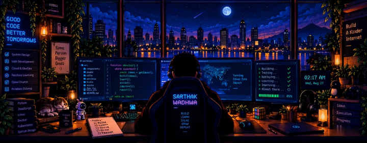

# Sarthak Wadhwa 👋

### Developer · Scalable Backend Systems · Cloud · Architecture & Infrastructure

Building useful things, learning continuously, and solving interesting problems.

 

---

### ✦ About Me

**Backend-focused developer** interested in scalable systems,  
distributed architecture, cloud infrastructure, and building real products.

`BUILD` · `LEARN` · `SOLVE` · `SHIP`

---

## 🛠️ Tech I Work With

---

## 🚀 Featured Projects

| Project | What it is |
|:---|:---|
| 🧠 **[Cross-Environment TPC-H Runtime Prediction](https://github.com/sarthakwadhwa2005/Cross-Environment-TPC-H-Runtime-Prediction)** | Predicting query runtime across different computing environments |
| 🖼️ **[Distributed Image Processing System](https://github.com/sarthakwadhwa2005/Distributed-Image-Processing-System)** | Distributed image-processing workflows built with Python |
| ⚓ **[Docksmith](https://github.com/sarthakwadhwa2005/Docksmith)** | Exploring container-oriented and deployment workflows |
| 📅 **[Event Management](https://github.com/sarthakwadhwa2005/Event-Management)** | Web application for event management |
| 🔐 **[GDPR Consent Manager](https://github.com/sarthakwadhwa2005/gdpr-consent-manager)** | GDPR-focused consent management project |
| 🍔 **[Online Food Delivery System](https://github.com/sarthakwadhwa2005/Online-Food-Delivery-System)** | Web-based food delivery application |

---

## 📊 GitHub

 

---

### 🌌

**Good code. Better systems. Bigger ideas.**

 

`Thanks for stopping by.`

